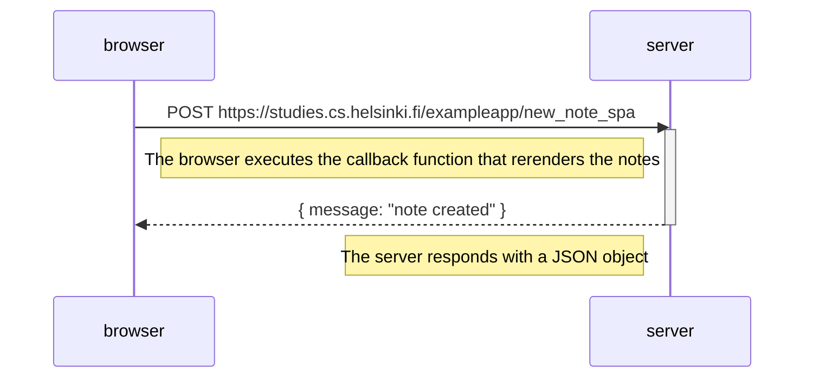

```mermaid
sequenceDiagram
  participant browser
  participant server

  browser->>server: POST https://studies.cs.helsinki.fi/exampleapp/new_note_spa
  activate server
  Note right of browser: The browser executes the callback function that rerenders the notes

  server-->>browser: { message: "note created" }
  deactivate server

  Note left of server: The server responds with a JSON object
```